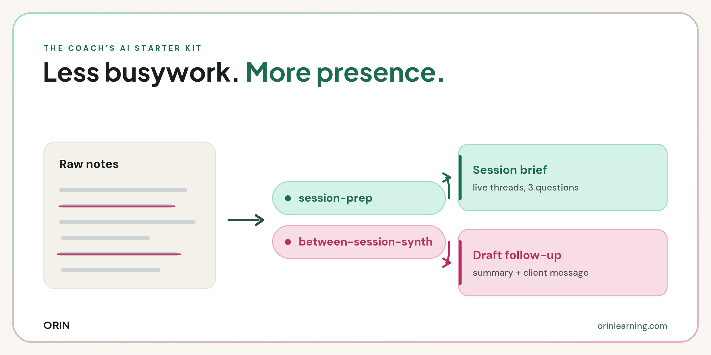

# Coach's AI Starter Kit — Skills

Two [Claude Code](https://claude.com/claude-code) skills that hand the busywork around a coaching session to AI, so you can give the human part your full attention.

Part of the Coach's AI Starter Kit by [Orin Learning Intelligence](https://orinlearning.com).

<!-- Drop a hero image here once you have one:
 -->

Point them at your session notes and they will:

1. **Prep you for the next session** (`session-prep`) — read your notes from recent sessions with one client and hand back a tight brief: live threads, what's shifted, three questions to open with, and what you might be circling or avoiding.
2. **Clean up the last one** (`between-session-synth`) — turn raw session notes into two blocks: a private summary for your records, and a short client follow-up drafted in your voice.

Pure time-savers. They don't track growth across a program or build an evidence portfolio over time. That work is what Orin does.

## Why this exists

Coaches spend a surprising amount of energy on the work *around* the conversation: prepping cold before a session, writing up notes after, drafting the follow-up. None of that is the coaching itself. These two skills take that load off so the session gets your full attention. They're what we hand coaches first in the Coach's AI Starter Kit.

## Requirements

- [Claude Code](https://claude.com/claude-code), Claude.ai, or Claude Cowork (anywhere skills run)
- Four context files (optional, but the skills get sharper with them) — see [Context files](#context-files)

## Install

**From a packaged file** — download a `.skill` from `dist/` and open it in Claude (Cowork or Claude Code shows a "Save skill" button), or upload the zip in Claude's skill settings.

**From source (Claude Code)** — copy each skill folder into your skills directory:

```bash
git clone https://github.com/celinekrzan/orin-coach-ai-skills.git
cp -r orin-coach-ai-skills/session-prep orin-coach-ai-skills/between-session-synth ~/.claude/skills/
```

Restart Claude Code and `/session-prep` and `/between-session-synth` are available.

## Usage

Each skill triggers on plain language — no command needed — or you can call it directly.

**Before a session:**

```
/session-prep
```

Paste your notes from the last few sessions with one client. You get back a scannable brief in under a minute: live threads, what's shifted, three questions to open with, and what you might be avoiding.

**After a session:**

```
/between-session-synth
```

Paste your raw session notes. You get back two labeled blocks — a private **For your records** summary, and a **Draft follow-up** to the client in your voice, ready to edit and send.

## Context files

The skills are sharper when they can read your context. Build these four once using the prompts in the starter kit, keep them in a Claude Project, and every skill reads them automatically:

| File | Used by | What it holds |
|------|---------|---------------|
| `about-me.md` | `session-prep` | Who you are and who you coach |
| `how-i-coach.md` | both | Your philosophy, frameworks, and boundaries |
| `my-voice.md` | `between-session-synth` | How you sound, so follow-ups read like you and not a chatbot |

If a file is missing, the skill asks for it once and continues — it never blocks.

## How the skills work

Both follow the same shape: load your context files, take your raw notes, and return a tight, specific output with no filler. They're built with guardrails, not just prompts:

- **You decide, AI drafts.** The follow-up is never presented as ready to send. You read it and make it yours.
- **Nothing invented.** No fabricated quotes, decisions, or commitments that aren't in your notes.
- **Privacy first.** Each skill reminds you to strip client names and identifying details before you paste.

## Repo structure

```
orin-coach-ai-skills/
├── README.md
├── session-prep/
│   └── SKILL.md            # the prep brief skill
├── between-session-synth/
│   └── SKILL.md            # the summary + follow-up skill
└── dist/
    ├── session-prep.skill          # packaged, ready to open in Claude
    └── between-session-synth.skill
```

---

Built by [Orin Learning Intelligence](https://orinlearning.com).
